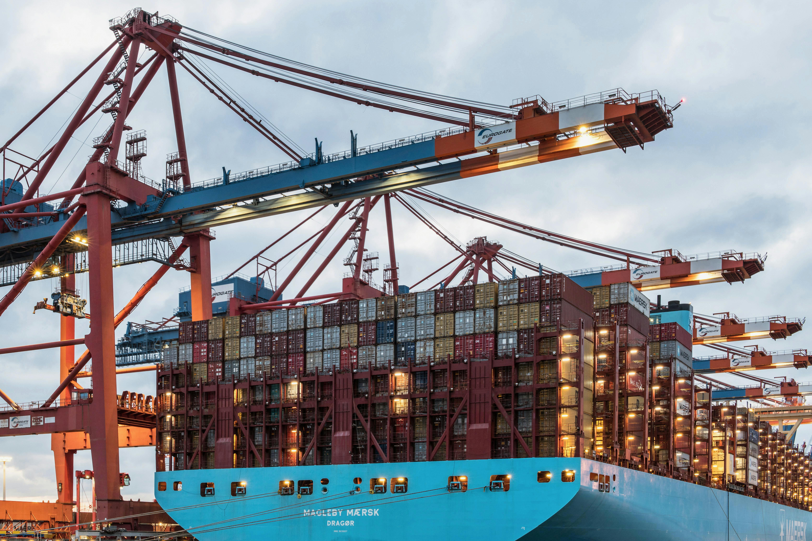

# Container-Based Application Design

Virtualization has evolved significantly from heavy Hypervisors to lightweight Containers, changing how we build and deploy distributed systems. This technical report investigates this shift, providing a bridge between theoretical OS concepts and practical cloud-native engineering.

## What's Inside the Report?

This document isn't just a "how-to" guide; it analyzes the *why* and *how* behind container technologies.

### 1. Theoretical Foundations
Understanding the Linux Kernel mechanisms that make containers possible:
- **Hypervisors vs. Containers:** A comparison of Type 1/2 Hypervisors against OS-level virtualization.
- **Namespaces:** How the kernel isolates resources like Process IDs (PIDs) and Networks.
- **Cgroups (Control Groups):** How the kernel limits resource usage to prevent the "Noisy Neighbor" problem.

### 2. Docker Architecture Deep Dive
Docker isn't a monolith. We break down its internal components:
- **runc & containerd:** The role of the OCI standard and container runtimes.
- **OverlayFS:** How Union File Systems create efficient, multi-layered images.
- **Container Networking:** Understanding VETH pairs and NAT masquerading.

### 3. Engineering a Cloud-Native App
A practical walkthrough of building **Nebula Core**, a Spring Boot microservice:
- **Multi-Stage Builds:** Reducing image size from ~800MB to ~150MB.
- **Docker Compose:** Defining infrastructure as code for local development.
- **Service Discovery:** How containers communicate via internal DNS.

### 4. The Need for Orchestration
Why Docker Compose isn't enough for production and how **Kubernetes (K8s)** solves critical distributed systems challenges:
- Self-Healing & ReplicaSets
- Horizontal Pod Autoscaling (HPA)
- Zero-Downtime Rolling Updates

---

## Download the Full Report

For a comprehensive analysis, including architecture diagrams, code snippets, and detailed explanations, download the full PDF version below.

📥 **[Download PDF: Container-Based Application Design](./assets/Container-Based-Architecture-Report.pdf)**

---

## Code Reference

The source code for the "Nebula Core" project discussed in the report is available on GitHub:

🔗 [https://github.com/j-imsa/Nebula](https://github.com/j-imsa/Nebula)